# react-native-zoom-us-bridge
This library bridges React Native with zoom.us SDK and implements the SDK authentication process.

Library updated to use iOS SDK v5.12.2.4959 and Android SDK version v5.12.2.9109, or higher

***Note:  User login using zoom user accounts is not implemented.***

## Table of Contents

* [Installation](#installation)
  * [iOS](#ios-zoomus-sdk-installation)
  * [Android](#android-zoomus-sdk-installation)
* [Zoom Account Setup](#zoom-account-setup)
* [Usage](#usage)
* [Errors](#errors)
* [Running the Example app](#example-project)


## Installation

Install the library from npm:

```sh
npm i @mokriya/react-native-zoom-us-bridge --save
```

or

```sh
yarn add @mokriya/react-native-zoom-us-bridge
```

### Linking
Library Autolinks for React-Native 60 or higher.

RN 59 or lower please make sure to
```sh
react-native link @mokriya/react-native-zoom-us-bridge
```

Then follow the instructions for your platform to add ZoomUS SDK into your project:


### iOS ZoomUS SDK installation

Manual Link is the only way. Zoom changed the way iOS SDK is packaged, and its no longer possible to use Cocoapods.

[Download zoom.us iOS SDK at https://marketplace.zoom.us](https://marketplace.zoom.us)

1. Unzip the SDK and locate contents.
2. Drag lib folder into the iOS Project
    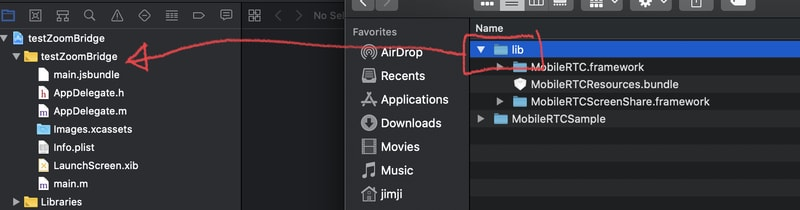
3. Make sure to check `copy if needed`
    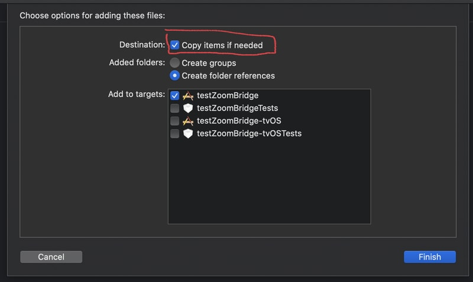
4. Rename folder to `ZoomSDK` double check by looking up the folder in finder or terminal.
    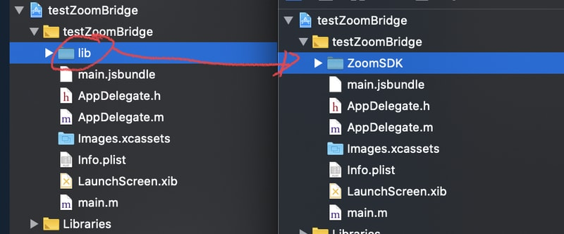
    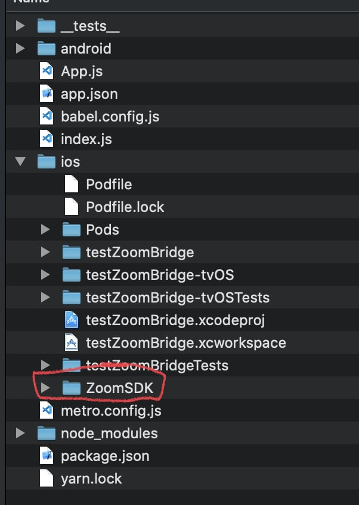
5. On Xcode Open ZoomSDK folder, find MobileRTC.framework, drag it to General -> Frameworks, Libraries... make sure its set to `Embed & Sign` (ios_image5)
    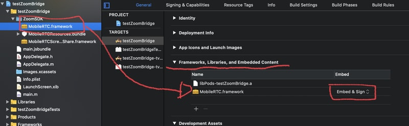
6. Verify the `ZoomSDK` folder is in `Build Phases`, `Copy Bundle Resources`, if not, drag the folder in there.
    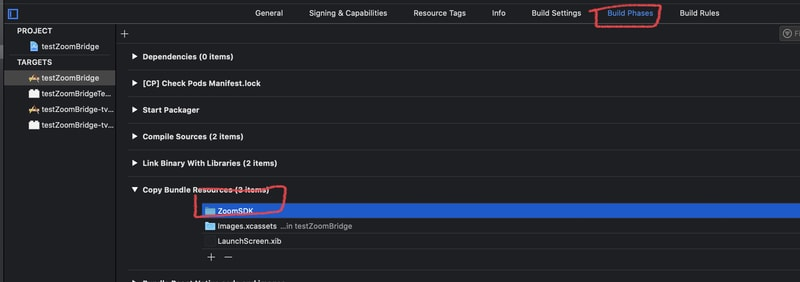

See [here](https://marketplace.zoom.us/docs/sdk/native-sdks/iOS/getting-started/integration) for more information.

### Bitcode

Zoom SDK library does not support bitcode. Please make sure to set bitcode to `No`
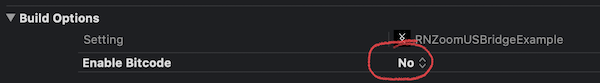

### App store submission (iOS)

The app's `Info.plist` file must contain a `NSCameraUsageDescription` and `NSMicrophoneUsageDescription` with a description explaining clearly why your app needs access to the camera and microphone, otherwise Apple will reject your app submission.


### Android ZoomUS SDK installation
If you are using RN 59 or lower, you will need to enable Android X. Add this to your `gradle.properties`
```
android.useAndroidX=true
android.enableJetifier=true
```

***There are no semi-auto way to install the Android SDK at the moment. It must be done 100% manually.***

[Download zoom.us Android SDK at https://github.com/zoom/zoom-sdk-android](https://github.com/zoom/zoom-sdk-android)

1. Unzip the SDK and locate `commonlib` and `mobilertc`.
2. Drag both folders into your android project (Project/android)
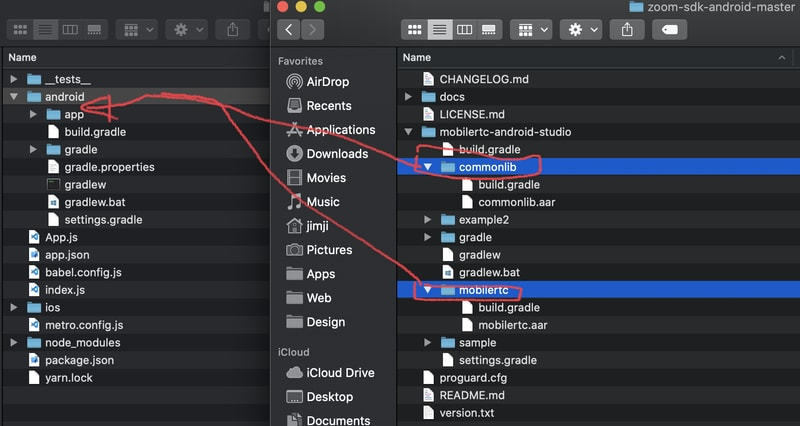
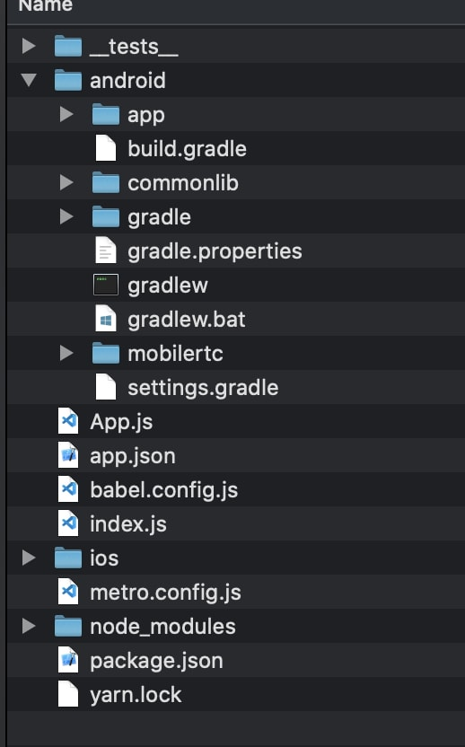

3. Open `android/settings.gradle`
     - Add the following lines after `include ':app'`
    ```
    include ':mobilertc'
    include ':commonlib'
    ```
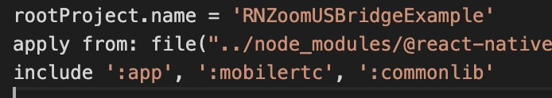

4. Open `android/build.gradle`
     - Update your SDK versions to match the following or higher
    ```groovy
        buildToolsVersion = "29.0.0"
        minSdkVersion = 21
        compileSdkVersion = 29
        targetSdkVersion = 29
    ```


5. Open `android/app/build.gradle`
   - Add `multiDexEnabled true` into `defaultConfig`
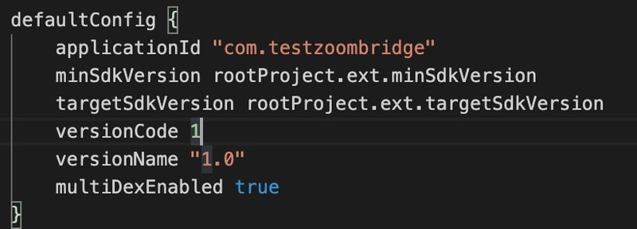
   - Add these lines after `compileOptions {}`
   ```
   packagingOptions {
        pickFirst 'lib/armeabi-v7a/libc++_shared.so'
        pickFirst 'lib/arm64-v8a/libc++_shared.so'
        pickFirst 'lib/x86/libc++_shared.so'
        pickFirst 'lib/x86_64/libc++_shared.so'
    }
    ```
   - Add these lines to `dependencies`
    ```
    implementation project(':commonlib')
    implementation project(':mobilertc')
    ```

6. Open `MainApplication.java`
    - Add `SoLoader.loadLibrary("zoom");` right under `SoLoader.init(this, /* native exopackage */ false);` this is done to fix the `bad_cast` error 

7. Run script to fix issues with `cannot locate symbol "__cxa_bad_typeid"` due to `libc++_shared.so`. Please do this after you have copied the `mobilertc.aar` to the correct folder
    - From root of project folder, execute `./node_modules/react-native-zoom-us-bridge/scripts/mobilertc-precompile.sh`

Steps 6 and 7 must be done due to an issue with the Zoom Android SDK having an incompatible version of `lib++_shared.so`. Shoutout and kudos to [**Stefan Majiros**](https://stefan-majiros.com) for documenting crucial steps on getting the `mobilertc.aar` library to build. Without his insights this would have been impossible. [Blog post](https://stefanmajiros.medium.com/how-to-integrate-zoom-sdk-into-react-native-47492d4e46a6)

See [here](https://marketplace.zoom.us/docs/sdk/native-sdks/android/getting-started/integration) for more official information on android integration.


## Zoom Account Setup

1. [Signup for an account](https://zoom.us/signup)
2. Verify your email
3. [Signin to the developer console](https://marketplace.zoom.us)
4. Agree to terms of becoming a developer
5. [Create a new SDK App](https://marketplace.zoom.us/docs/sdk/native-sdks/preface/sdk-app)
6. [Create a new JWT App (optional for hosting meetings)](https://marketplace.zoom.us/docs/guides/authorization/jwt-app)

## Usage

### Storing App/Jwt key on app securely
You should avoid hardcoding your App/Jwt key and secret. In our example we hardcode the data for example only. There are various ways to store your key/secret safely on the net. Please make sure to read and find your best possible way. [rn security](https://reactnative.dev/docs/security)

### Basic joining meeting
**APP key and secret is required**
```javascript
import RNZoomUsBridge from '@mokriya/react-native-zoom-us-bridge';

RNZoomUsBridge.initialize(
  ZOOM_APP_KEY,
  ZOOM_APP_SECRET,
);

RNZoomUsBridge.joinMeeting(
  meetingId,
  userName,
  meetingPassword,
);

```
### Hosting meeting
**JWT key and secret is required**

```javascript
import RNZoomUsBridge from '@mokriya/react-native-zoom-us-bridge';

RNZoomUsBridge.initialize(
  ZOOM_APP_KEY,
  ZOOM_APP_SECRET,
);

// create accessToken used to communicate with zoom api
const accessToken = await RNZoomUsBridge.createJWT(
  ZOOM_JWT_APP_KEY,
  ZOOM_JWT_APP_SECRET
).then().catch((err) => console.log(err));

// use accessToken to get userId of the user account you are creating the meeting with
const userId = await getUserID('user@email.com', accessToken);

// use the userId to obtain the user Zoom Access Token
const userZak = await createUserZAK(userId, accessToken);

// use Access Token etc, to create a meeting
const createMeetingResult = await createMeeting(userId, accessToken);

// get meeting id from result
const {id: meetingId} = createMeetingResult;

// use the meeting Id, userId, user name and user zoom access token to start & join the meting
RNZoomUsBridge.startMeeting(
  meetingId,
  userName,
  userId,
  userZak
);
```

### Events from zoom sdk
Use event emitter to listen for meeting state changes
```javascript
import RNZoomUsBridge, {RNZoomUsBridgeEventEmitter} from '@mokriya/react-native-zoom-us-bridge';

const meetingEventEmitter = new NativeEventEmitter(RNZoomUsBridgeEventEmitter);

meetingEventEmitter.addListener(
  'SDKInitialized',
  () => {
    console.log("SDKInitialized");
  }
);

```
| Listener             | Description                                  |
|----------------------|----------------------------------------------|
| SDKInitialized       | Status update - SDK initialized successfully |
| meetingStarted       | Status update - Meeting started successfully |
| meetingJoined        | Status update - Meeting joined successfully  |
| meetingEnded         | Status update - Meeting ended without error  |
| meetingStatusChanged | Status update - Updates the meeting status   |
| meetingError         | Error - Meeting ended with error             |
| waitingRoomActive    | Error - Meeting waiting room is active       |

## Frequently Asked Questions
### Can Zoom US bridge join a meeting created from other zoom apps?
Yes, as long as waiting room is turned off (iOS only), and user does not need to login.

### Can Zoom US bridge create a meeting?
Yes.

### Can Zoom US bridge start a meeting?
Yes, as long as the user matches the user whom created the meeting.

### Can Zoom US bridge join a meeting that have waiting room?
No, not currently (iOS only). Android does support waiting room.

### Can Zoom US bridge join a meeting that have not started?
No, not currently (iOS only).

### Can Zoom US bridge use Zoom's custom UI?
No, not currently.

### Why is there event listener if startMeeting and joinMeeting already returns result?
The result returned from startMeeting and joinMeeting are simple status that indicate if the command was executed successfully or not. The actual meeting joined status might not be available until a few seconds later. Always rely on the meetingJoined listener to determine if meeting have been joined successfully.

### Can user login to zoom via Zoom US bridge?
No, not currently. At the moment Zoom US bridge uses SDK App Key and JWT App Key.

### Does user account need to be in the same account as App SDK/JWT?
Yes.

## Errors
[See Common Errors Here](COMMON_ERRORS.md)

## Example Project

[Follow Example Setup Here](RNZoomUSBridgeExample/README.md)

| Android                                                                                                                   | iOS                                                                                                                       |
| --------------------------------------------------------------------------------------------------------------------- | ----------------------------------------------------------------------------------------------------------------------------- |
| 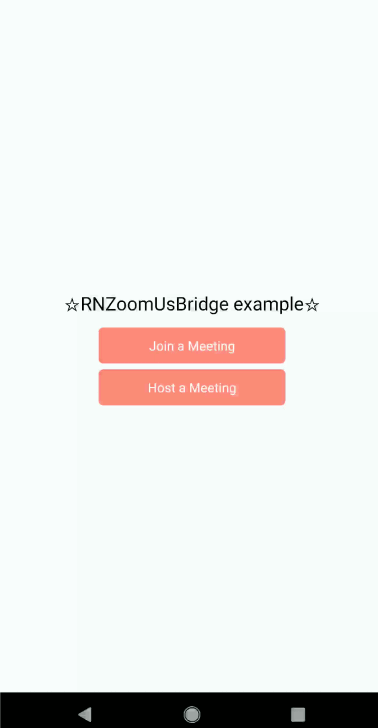 |  |

